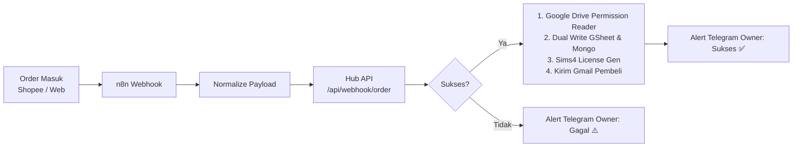

# Panduan Otomatisasi n8n MyGameON Hub

Blueprint workflow ini menghubungkan alur pesanan dari berbagai channel (Website `mygameon.store`, Shopee, Tokopedia, Payment Gateway) secara otomatis ke **MyGameON Hub Backend**, memberikan hak akses Google Drive multi-workspace, men-generate lisensi The Sims 4, mengirim email instruksi ke pembeli, dan mengirim notifikasi real-time ke Telegram Owner.

---

## 1. Persiapan Variabel di n8n

Pastikan instance n8n kamu memiliki environment variables atau credentials berikut:

| Variabel | Nilai Contoh | Keterangan |
|---|---|---|
| `HUB_API_URL` | `http://localhost:3000` atau URL tunnel (`https://hub.mygameon.store`) | Base URL aplikasi MyGameON Hub |
| `ORDER_WEBHOOK_SECRET` | `mgo_wh_sec_99a8b7c6d5e4f3a2b1` | Token otentikasi webhook (sesuai `.env.local` Hub) |
| `TELEGRAM_ADMIN_CHAT_ID` | `123456789` | Chat ID / Group ID Telegram Owner untuk alert |

---

## 2. Cara Import Workflow

1. Buka dashboard n8n kamu.
2. Di pojok kanan atas, klik tombol **Add Workflow** &rarr; klik ikon **`...`** (menu) &rarr; pilih **Import from File**.
3. Pilih file [`order-automation-workflow.json`](./order-automation-workflow.json).
4. Konfigurasikan credential **Telegram Bot** pada node Telegram dengan Token Bot Telegram kamu.
5. Klik **Save** dan aktifkan status workflow (**Active**).

---

## 3. Format Payload Webhook

Endpoint webhook n8n kamu akan menerima request `POST` pada:
`https://<n8n-instance-kamu>/webhook/mygameon-order`

### Contoh 1: Pesanan Game PC Biasa
```json
{
  "customerEmail": "pembeli@gmail.com",
  "invoice": "INV-2026-PC01",
  "platform": "website",
  "items": [
    { "name": "Cyberpunk 2077" },
    { "name": "Red Dead Redemption 2" }
  ],
  "expirationDays": 30,
  "sendEmail": true
}
```

### Contoh 2: Pesanan The Sims 4
```json
{
  "customerEmail": "simmer@gmail.com",
  "invoice": "INV-2026-SIMS01",
  "platform": "shopee",
  "items": [
    {
      "name": "The Sims 4 All DLCs",
      "type": "sims4",
      "allowCC": true
    }
  ],
  "sendEmail": true
}
```

### Contoh 3: Single Item Shorthand (Format Shopee/Tripay Webhook)
```json
{
  "email": "customer@gmail.com",
  "order_sn": "260919ABCDE",
  "product_name": "Elden Ring Deluxe Edition",
  "platform": "shopee"
}
```

---

## 4. Alur Kerja Otomatis


